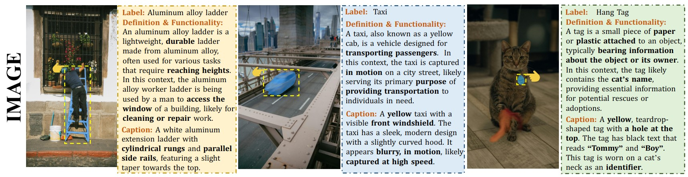
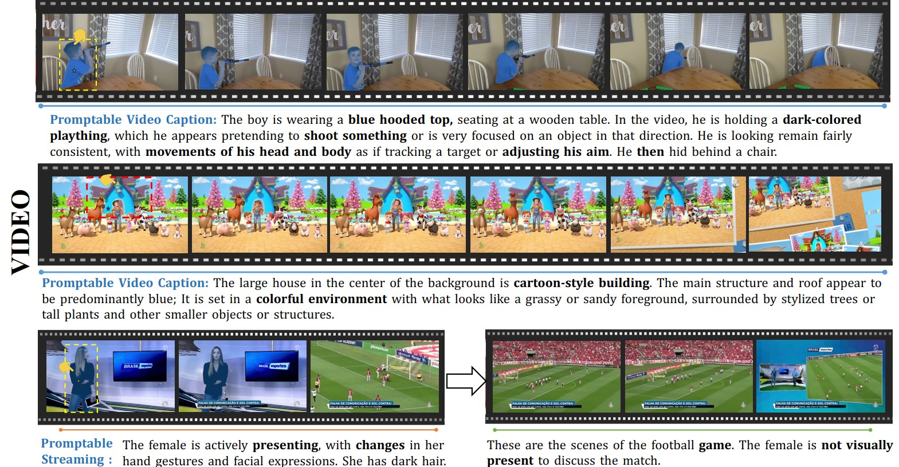
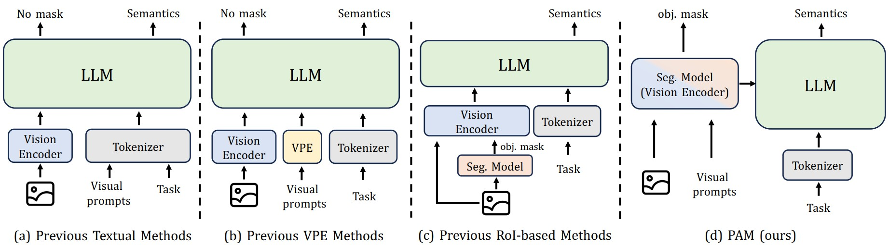
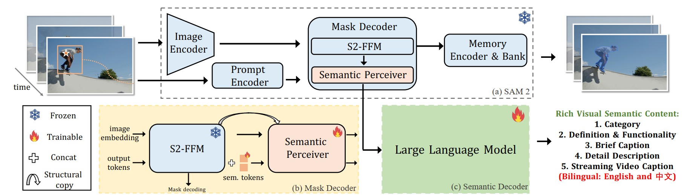

<div align="center">
<h1>
Perceive Anything: Recognize, Explain, Caption, and Segement Anything in Images and Videos (PAM)
</h1>

</div>

<div align="center">

[Weifeng Lin](), [Xinyu Wei](), [Ruichuan An](), [Tianhe Ren](), [Tingwei Chen](), [Renrui Zhang](), [Ziyu Guo]() <br>
[Wentao Zhang](), [Lei Zhang](), [Hongsheng Li]() <br>
CUHK, HKU, PolyU, PekingU

</div>

<p align="center">
  <a href="https://Perceive-Anything.github.io"><b>🌐 Project Website</b></a> |
  <a href="https://arxiv.org/abs/2506.05302"><b>📕 Paper</b></a> |
  <a href="https://huggingface.co/Perceive-Anything/PAM-3B"><b>📥 Model Download</b></a> |
  <a href="https://huggingface.co/datasets/Perceive-Anything/PAM-data"><b>🤗 Dataset</b></a> |
  <a href="#quick-start"><b>⚡Quick Start</b></a> <br>
  <a href="#license"><b>📜 License</b></a> |
  <a href="#citation"><b>📖 Citation (BibTeX)</b></a> <br>
</p>

<p align="center">
     <br>
     <br>
</p>

## News

<!-- **2025.06.20**: Release Gradio demo ([online demo]() and [local](#gradio-demo)) -->

<!-- **2025.06.05**: Evaluation code Please refer to [this link](). -->

**2025.06.08**: Model weights (1.5B / 3B) and training datasets are released. Please refer to [PAM-1.5B](https://huggingface.co/Perceive-Anything/PAM-1.5B), [PAM-3B](https://huggingface.co/Perceive-Anything/PAM-3B) and [Datasets](https://huggingface.co/datasets/Perceive-Anything/PAM-data).

**2025.06.08**: PAM is released, a simple end-to-end region-level VLM for object segmentation and understanding. See [paper](https://arxiv.org/abs/2506.05302)


## Introduction

**Perceive Anything Model (PAM)** is a conceptually simple and efficient framework for comprehensive region-level visual understanding in images and videos. Our approach extends SAM 2 by integrating Large Language Models (LLMs), enabling simultaneous object segmentation with the generation of diverse, region-specific semantic outputs, including categories, label definition, functional explanations, and detailed captions. We propose to efficiently transform SAM 2's rich visual features, which inherently carry general vision, localization, and semantic priors into multi-modal tokens for LLM comprehension. To support robust multi-granularity understanding, we develop a dedicated data refinement and augmentation pipeline, yielding a high-quality [**dataset**](https://huggingface.co/datasets/Perceive-Anything/PAM-data) of image and video region-semantic annotations, including novel region-level streaming video caption data.


<p align="center">
     <br>
     <br>
</p>

## Installation

1. Clone this repository and navigate to the base folder
```bash
git clone https://github.com/Afeng-x/PAM.git
cd PAM
```

2. Install packages
```bash
### packages for base
conda create -n PAM python=3.10 -y
conda activate PAM
pip install --upgrade pip
pip install -e ".[train]"
### packages for sam2
cd sam2
pip install -e ".[notebooks]"
```

3. Install Flash-Attention
```bash
pip install flash-attn --no-build-isolation
### (If the method mentioned above don’t work for you, try the following one)
git clone https://github.com/Dao-AILab/flash-attention.git
cd flash-attention
python setup.py install
```

4. Download the SAM2.1-h-large checkpoint:
```bash
cd llava/model/multimodal_encoder
bash download_ckpts.sh
```

## Quick Start

- Image: Please refer to the examples in [image_infer_example.ipynb](./notebooks/image_infer_example.ipynb)
- Video: Please refer to the examples in [video_infer_example.ipynb](./notebooks/video_infer_example.ipynb)
- Video Stream: Please refer to the examples in [video_stream_infer_example.ipynb](./notebooks/video_stream_infer_example.ipynb)

## Dataset

Please refer to [this link](https://huggingface.co/datasets/Perceive-Anything/PAM-data) to download our refined and augmented data annotations.

**Note:** We do not directly provide the source images. However, for each dataset, we will provide the relevant download links or official website addresses to guide users on how to download them. [DATA_README](data/README.md)

<!-- ## Training PAM

You can train or fine-tune PAM on custom datasets of images, videos, or both. Please check the training [README](training/README.md) on how to get started. -->

## Local Gradio Demo for PAM
In progress ......
<!-- ### Simple Gradio Demo for Image

[`pam_image.py`](pam_image.py) - Interactive Gradio web interface for drawing masks on images and getting semantics. **This demo is tested with `gradio` 5.5.0.**

### Simple Gradio Demo for Video

[`pam_video.py`](pam_video.py) - Interactive Gradio web interface for drawing masks on videos and getting semantics. **This demo is tested with `gradio` 5.5.0.** -->

## License

This code repository is licensed under [Apache 2.0](./LICENSE).

## Acknowledgement
We would like to thank the following projects for their contributions to this work:

- [LLaVA-Next](https://github.com/LLaVA-VL/LLaVA-NeXT)
- [SAM](https://github.com/facebookresearch/segment-anything)
- [SAM 2](https://github.com/facebookresearch/sam2)

## Citation

If you find PAM useful for your research and applications, or use our dataset in your research, please use the following BibTeX entry.

```bibtex
@misc{lin2025perceiveanythingrecognizeexplain,
      title={Perceive Anything: Recognize, Explain, Caption, and Segment Anything in Images and Videos}, 
      author={Weifeng Lin and Xinyu Wei and Ruichuan An and Tianhe Ren and Tingwei Chen and Renrui Zhang and Ziyu Guo and Wentao Zhang and Lei Zhang and Hongsheng Li},
      year={2025},
      eprint={2506.05302},
      archivePrefix={arXiv},
      primaryClass={cs.CV},
      url={https://arxiv.org/abs/2506.05302}, 
}
```

